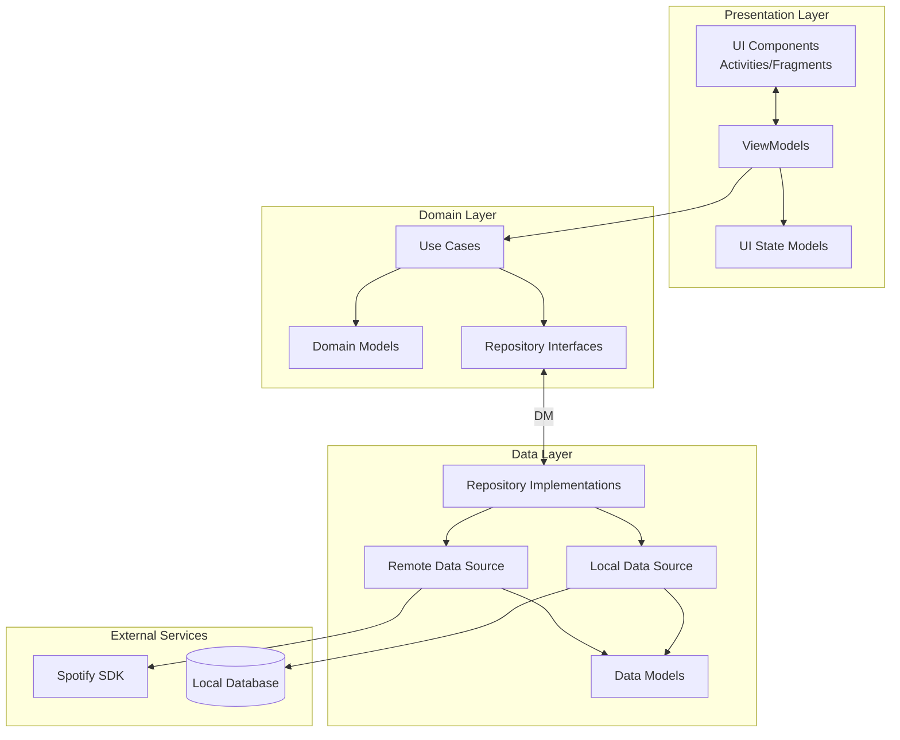
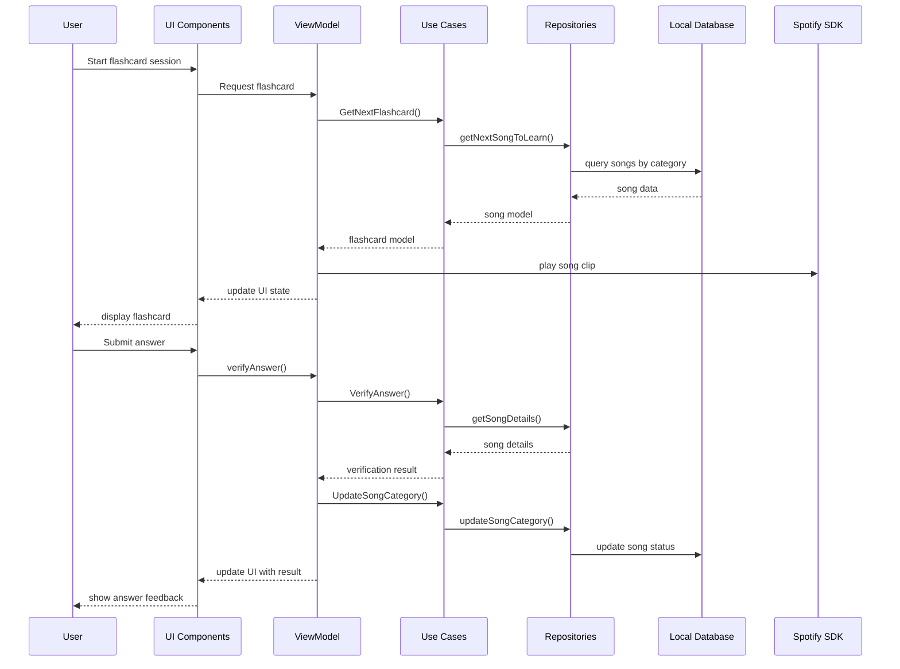

# MusicMinds App Architecture

## Overview

MusicMinds is designed as a native Android application following modern architecture principles. The app uses a clean architecture approach with MVVM (Model-View-ViewModel) pattern to ensure separation of concerns, testability, and maintainability.

## Architecture Layers

The application is divided into the following layers:

### 1. Presentation Layer
- User interface components (Activities, Fragments)
- ViewModels
- UI state models
- Adapters and custom views

### 2. Domain Layer
- Use cases (business logic)
- Domain models
- Repository interfaces

### 3. Data Layer
- Repository implementations
- Data sources (local database, Spotify API)
- Data models and mappers

## Component Diagram



## Key Components

### ViewModels
- `FlashcardViewModel`: Manages flashcard session state and song playback
- `SongLibraryViewModel`: Manages song library and categorization
- `SearchViewModel`: Handles song search functionality
- `PlaylistImportViewModel`: Manages playlist import process
- `UserProgressViewModel`: Tracks user learning progress

### Use Cases
- `GetNextFlashcardUseCase`: Determines the next song for flashcard
- `VerifyAnswerUseCase`: Verifies user answers against song metadata
- `UpdateSongCategoryUseCase`: Updates song learning category
- `SearchSongsUseCase`: Searches for songs via Spotify
- `ImportPlaylistUseCase`: Imports songs from playlists

### Repositories
- `SongRepository`: Manages song data and operations
- `UserProgressRepository`: Manages user progress data
- `SpotifyRepository`: Handles Spotify API interactions

### Data Sources
- `SpotifyDataSource`: Interfaces with Spotify SDK
- `LocalSongDatabase`: Stores song metadata and learning state
- `UserPreferencesDataStore`: Manages user preferences

## Data Flow Diagram



## Technology Stack

### Core Framework
- Kotlin as primary language
- Android Jetpack components

### UI
- Material Design 3 components
- Jetpack Compose (optional)
- ViewBinding/DataBinding

### Asynchronous Programming
- Kotlin Coroutines
- Flow for reactive streams

### Dependency Injection
- Hilt or Koin

### Local Storage
- Room Database
- DataStore for preferences

### Remote Data
- Retrofit for additional API calls
- Spotify Android SDK

### Testing
- JUnit for unit testing
- Espresso for UI testing
- Mockk for mocking dependencies

## Module Structure

```
app/
├── di/                # Dependency injection modules
├── presentation/      # UI components
│   ├── flashcard/     # Flashcard feature
│   ├── search/        # Song search feature
│   ├── library/       # Song library management
│   └── settings/      # App settings
├── domain/            # Business logic and models
│   ├── usecase/       # Application use cases
│   ├── model/         # Domain models
│   └── repository/    # Repository interfaces
└── data/              # Data handling
    ├── repository/    # Repository implementations
    ├── local/         # Local data sources
    ├── remote/        # Remote data sources
    └── model/         # Data transfer objects
```

## State Management

The app uses unidirectional data flow:
1. UI events trigger ViewModel methods
2. ViewModels interact with Use Cases
3. Use Cases coordinate with Repositories
4. Repositories fetch/modify data from sources
5. Data flows back up the chain as state
6. UI observes and renders state changes

## Considerations for Future Expansion

- The architecture is designed to support additional features with minimal changes
- New song categorization mechanisms can be added by implementing new Use Cases
- Additional data sources can be added by implementing new Repository components
- The UI layer can be updated independently without affecting business logic
