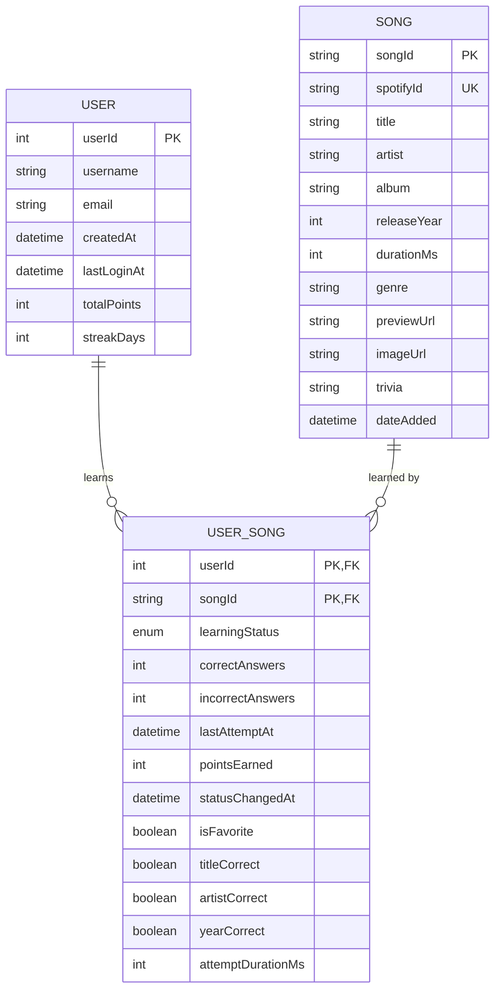

# MusicMinds Database Design

## Overview

This document outlines the database design for the MusicMinds application. The database will store song metadata, learning progress, user preferences, and maintain the relationships between these entities.

## Entity-Relationship Diagram



## Entity Descriptions

### User
Stores information about app users:
- `userId`: Unique identifier for the user
- `username`: User's chosen display name
- `email`: User's email address (optional)
- `createdAt`: When the user account was created
- `lastLoginAt`: Most recent login time
- `totalPoints`: Cumulative points earned by the user
- `streakDays`: Number of consecutive days with activity

### Song
Stores metadata about songs in the system:
- `songId`: Internal unique identifier
- `spotifyId`: Spotify's track ID for integration
- `title`: Song title
- `artist`: Song artist name(s)
- `album`: Album name
- `releaseYear`: Year when the song was released
- `durationMs`: Song duration in milliseconds
- `genre`: Primary genre classification (optional)
- `previewUrl`: URL for the song preview clip
- `imageUrl`: URL for album/song artwork
- `trivia`: Interesting fact about the song
- `dateAdded`: When the song was added to the database

### UserSong
Represents the learning relationship between users and songs:
- `userId`: Reference to the user
- `songId`: Reference to the song
- `learningStatus`: Enum ("TO_LEARN", "LEARNING", "LEARNED")
- `correctAnswers`: Number of times correctly answered
- `incorrectAnswers`: Number of times incorrectly answered
- `lastAttemptAt`: When the song was last attempted
- `pointsEarned`: Total points earned for this song
- `statusChangedAt`: When the learning status last changed
- `isFavorite`: Whether the user has favorited this song
- `titleCorrect`: Whether title was guessed correctly in last attempt
- `artistCorrect`: Whether artist was guessed correctly in last attempt
- `yearCorrect`: Whether year was guessed correctly in last attempt
- `attemptDurationMs`: How long user took to answer in last attempt

## Learning Status Logic

The `learningStatus` in the UserSong table follows these rules:

1. **TO_LEARN**: Default status for newly added songs
2. **LEARNING**: Status after first attempt or demotion from LEARNED
3. **LEARNED**: Status after meeting learning criteria:
   - Correctly answered multiple times (configurable threshold)
   - OR correctly answered on first attempt

## Indexes

To optimize query performance, we'll create these indexes:

1. UserSong(userId, learningStatus) - Fast retrieval of songs by category
2. UserSong(lastAttemptAt) - Query recently attempted songs
3. Song(spotifyId) - Fast lookup during imports

## Data Migration Strategy

For future app updates that require schema changes:

1. Use Room Database's migration system
2. Implement version-specific migration classes
3. Test migrations with both empty and populated databases
4. Include fallback path for failed migrations

## Sample Queries

### Get Learning Songs for User
```sql
SELECT s.*
FROM Song s
JOIN UserSong us ON s.songId = us.songId
WHERE us.userId = ? AND us.learningStatus = 'LEARNING'
ORDER BY us.lastAttemptAt ASC
LIMIT 10
```

### Update Song Learning Status
```sql
UPDATE UserSong
SET learningStatus = ?,
    statusChangedAt = ?,
    correctAnswers = correctAnswers + ?
WHERE userId = ? AND songId = ?
```

### Get User Statistics
```sql
SELECT
    COUNT(*) as totalSongs,
    SUM(CASE WHEN learningStatus = 'LEARNED' THEN 1 ELSE 0 END) as learnedSongs,
    SUM(CASE WHEN learningStatus = 'LEARNING' THEN 1 ELSE 0 END) as learningSongs,
    SUM(CASE WHEN learningStatus = 'TO_LEARN' THEN 1 ELSE 0 END) as toLearnSongs,
    SUM(pointsEarned) as totalPoints
FROM UserSong
WHERE userId = ?
```